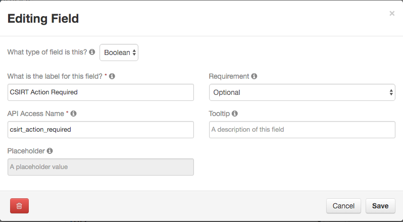
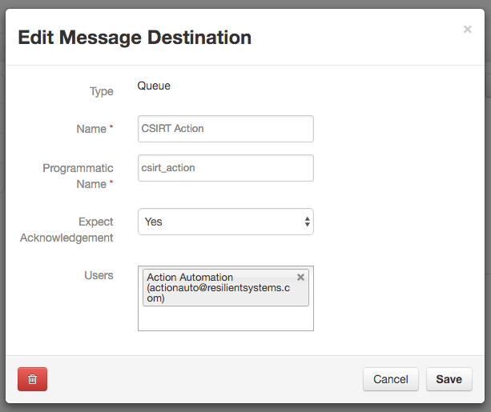

# Action handler for looking adding an incident type based on a custom field being changed.
In this case a Boolean field *CSIRT Action Required* is configured with an automatic action to add the 
incident type *CSIRT* when set to Yes.


## Execution
```
python csirtaction.py
```
OR
```
# NOTE, before building the docker image, put the resilient api and resilient_circuits
# python modules into the directory which contains the Dockerfile so that they will
# be installed into the Docker Image
docker build -t <imagename> .  # builds from the Dockerfile
docker run --name <descriptive name for the container> -v <path to log directory>:/code/logs  -d --restart=always <imagename from build>
#Note, the volume specified in the -v option must NOT be within the build directory of the docker file
```

## Configuration
The configuration is contained within *app.config*, to change which configuration file is loaded specify in the *APP_CONFIG_FILE* environment variable the full path to the filename e.g
```
export APP_CONFIG_FILE=/home/user/configuration.file
```
The example configuration file is kept in *Config/app.config*, and the *runit* shell script sets the environment

The configuration file is broken into sections as follows
### resilient
Connection information to the source org (used by the resilient_circuits module to connect to the source)
+ host = the hostname of the resilient server
+ port = 443 (always port 443)
+ email = Resilient user login (be sure that this user is not a SAML or Two Factor user, it also needs to have MasterAdministrator privileges in order to map enumerated field values)
+ password = the password for the resilient user
+ org = the name of the resilient org that will be the source of the record
+ stomp_port = 65001 (always 65001) Port for connecting to the Queue for the action module
+ logdir= fully qualified or relative path to the directory for the log file (app.log)
+ cafile= path to the file for the certificate for verification (used if a self signed certificate is used, or if the CA is not in your systems accepted CA list)
+ logfile= filename - defaults to app.log

### action
The destination queue for the action.  
+ queue= queue name configured in resilient

### actiondata
Configuration information for the action.  
+ incidenttype = text in the Name of the incident type

## Resilient Configuration
The default configuration expects an action queue named *csirt_action*, and an automatic action for an incident named 
*csirtaction*.  The automatic action should have have a condition of the Boolean field *csirt_action_required* being changed to Yes.
### Custom Field definition

### Messaged Destination 

### Automatic Action

