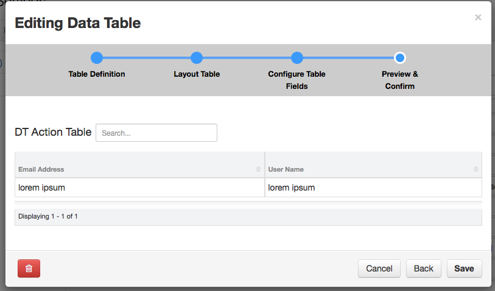

# Action handler for looking up a users name based on an email address put into a data table
This action takes a table defined with two columns in a row.  Both columns are text fields

| email_address | username |
 --- | ---
| xxx@yyy.com   | XXX User |

When a new row is added, the email address is looked up in a json file (Config/lookupfile.json) and the 
users name is put into the user_name column (cell).  

The action will trigger when a row is saved.  As you will still be in the resilient edit view for the incident
the table will not update, however once the incident is saved, or edit mode is canceled, the table will 
reflect the updates.

## Execution
```
python dtaction.py
```

## Configuration
The configuration is contained within *app.config*, to change which configuration file is loaded specify in the *APP_CONFIG_FILE* environment variable the full path to the filename e.g
```
export APP_CONFIG_FILE=/home/user/configuration.file
```
The example configuration file is kept in *Config/app.config*, and the *runit* shell script sets the environment

The configuration file is broken into sections as follows
### resilient
Connection information to the source org (used by the resilient_circuits module to connect to the source)
+ host = the hostname of the resilient server
+ port = 443 (always port 443)
+ email = Resilient user login (be sure that this user is not a SAML or Two Factor user, it also needs to have MasterAdministrator privileges in order to map enumerated field values)
+ password = the password for the resilient user
+ org = the name of the resilient org that will be the source of the record
+ stomp_port = 65001 (always 65001) Port for connecting to the Queue for the action module
+ logdir= fully qualified or relative path to the directory for the log file (app.log)
+ cafile= path to the file for the certificate for verification (used if a self signed certificate is used, or if the CA is not in your systems accepted CA list)
+ logfile= filename - defaults to app.log

### dtaction
The destination queue for the action.  
+ queue= queue name configured in resilient

### actiondata
Configuration information for the action.  
+ lookupfile = filename with path to lookup the username in
+ tablename = the resilient api name for the data table that the action will operate against

## Lookup file format
a simple json structure is used for the lookup file.  It is an array of structures which contain two elements, the name of the user and the email address.
'''
[
{"name":"XXX User","email":"xxx@yy.com"}
,{"name":"YYY User","email":"yyy@yy.com"}
]
'''

## Resilient Configuration
The default configuration expects an action queue named *dt_action*, and an automatic action for a table named *dt_action_table*.  The automatic action should have no conditions. 
A side effect of not having a condition is that the action will be triggered any time a row is added, deleted or modified.  The code attempts to handle these conditions (ignoring
the deletion of a row, performing the same lookup)
### Messaged Destination 

### Automatic Action

### Table Definitions



