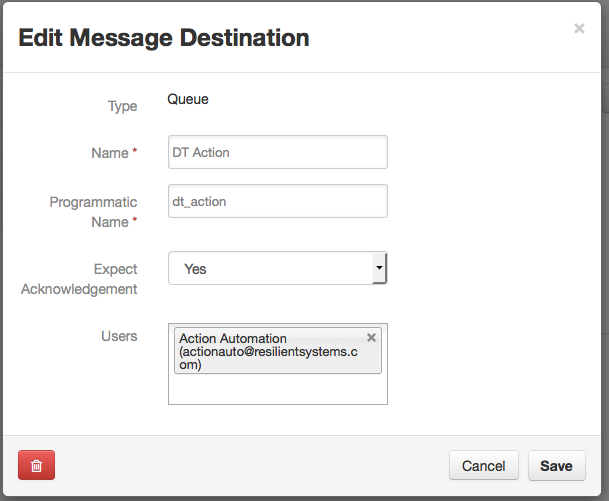
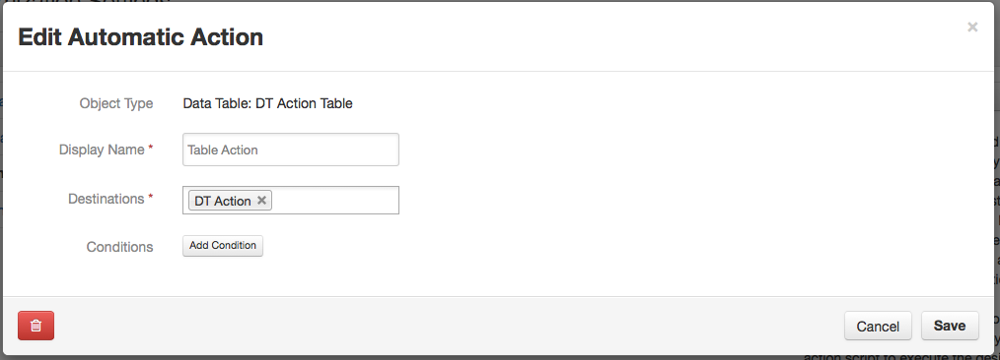
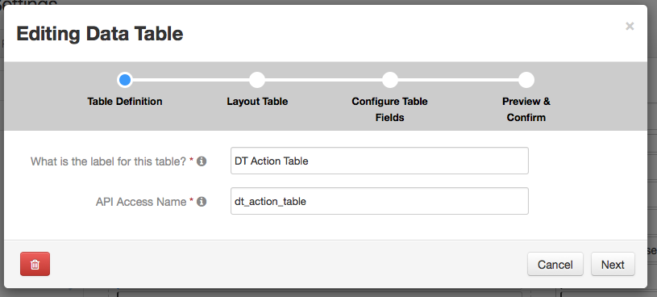
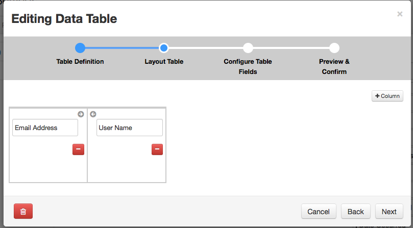
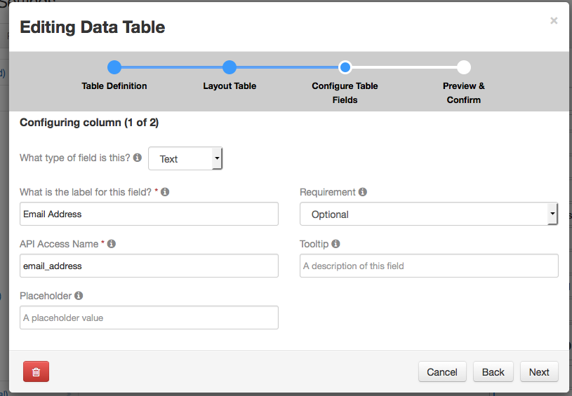
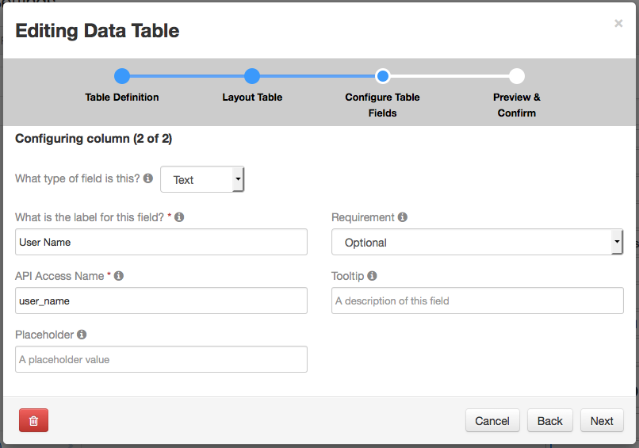

# TableAction
Action handler for looking up a users name based on an email address put into a data table
This action takes a table defined with two columns in a row.  Both columns are text fields

| email_address | username |
 --- | ---
| xxx@yyy.com   | XXX User |

When a new row is added, the email address is looked up in a json file (Config/lookupfile.json) and the 
users name is put into the user_name column (cell).  

The action will trigger when a row is saved.  As you will still be in the resilient edit view for the incident
the table will not update, however once the incident is saved, or edit mode is canceled, the table will 
reflect the updates.

## Execution
```
python dtaction.py
```

## Configuration
Within the configuration file, the following sections contain configuration specific to thie 
action processor.

### actiondata
Configuration information for the action.  
+ lookupfile = filename with path to lookup the username in
+ tablename = the resilient api name for the data table that the action will operate against

## Lookup file format
a simple json structure is used for the lookup file.  It is an array of structures which contain two elements, the name of the user and the email address.
'''
[
{"name":"XXX User","email":"xxx@yy.com"}
,{"name":"YYY User","email":"yyy@yy.com"}
]
'''

## Resilient Configuration
The default configuration expects an action queue named *dt_action*, and an automatic action for a table named *dt_action_table*.  The automatic action should have no conditions. 
A side effect of not having a condition is that the action will be triggered any time a row is added, deleted or modified.  The code attempts to handle these conditions (ignoring
the deletion of a row, performing the same lookup)
### Messaged Destination 

### Automatic Action

### Table Definitions





