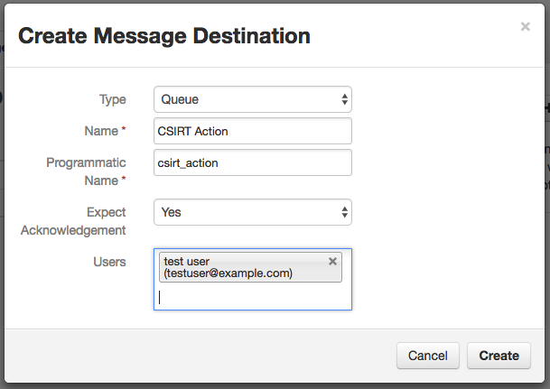
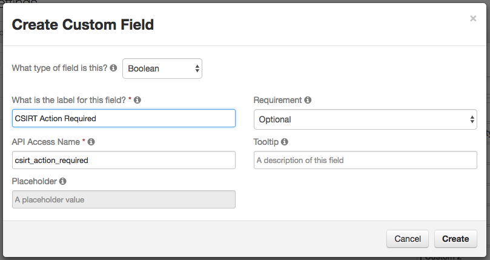
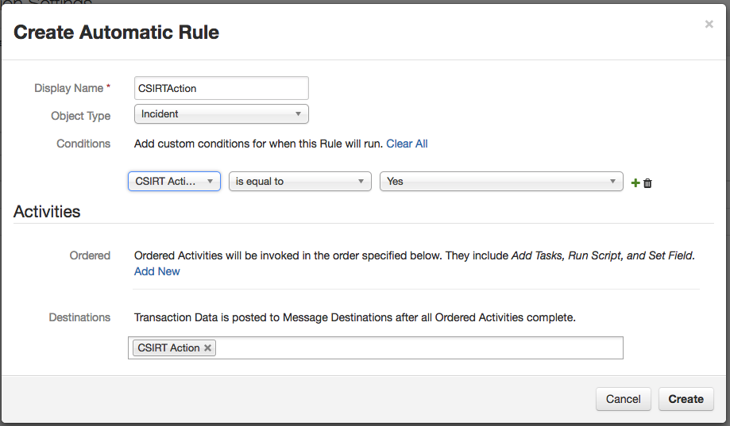

Add new Incident Type value when a custom field is set
======================================================

Use Case: An incident needs another Incident Type added to it based on other
conditions on the incident being met.

This integration can be run on the Resilient appliance or anywhere else.  
The code is written in Python, and can be extended for your own purposes.

Requires: Python version 2.7.x or 3.4.x or later.
Requires: Resilient Server or hosted Application, version 24 or later.

## Resilient server setup

You must configure the following customizations to the Resilient server.
Open the Administrator Settings --> Actions, then:

### Message Destination

Create a Queue message destination with programmatic name `csirt_action`.
Select Yes for "expect acknowledgement", and add the integration user
to its users list.

### Custom Field
Add a custom boolean field to the incident definition called
'csirt_action_required' You should add it to your detail view so that you can
access it easily to set it.

### Automatic Action
Create an automatic action called 'csirtaction' associated with object type
'Incident'.  Choose 'csirt_action' as the message destination.  The triggering
condition should be when field 'csirt_action_required' is set to True.

## Python setup

The Resilient REST API is accessed with a helper module 'co3' that should be
used for all Python client applications.  The 'co3' module is a part of the
Resilient REST API utilities 'co3-api'.  Download and install that first,
following its instructions.

This application is built using the circuits library.  The 'resilient-circuits'
framework should be downloaded and installed, following its instructions.

#### Installing the Integration

Unpack the integration's files into the location where you will run them. The
generic run.py script that is used for all circuits integrations can be found in
the main examples directory. The resilient api, and resilient-circuits modules
are also required, refer to the documentation for each of these modules.
Create the `logs` directory that the log file will be written to

## Configuring the Integration

The script reads configuration parameters from a file. The configuration file is
named `app.config`, in the same directory as the scripts.  Edit this file to
provide appropriate values appropriate for your environment (server URL and
authentication credentials). Verify that the logging directory has been created.

To set a different configuration file set the environment variable
'APP_CONFIG_FILE' to the path of the file you intend to use.

There are two sections to the configuration file.  The 'resilient' section
configures the parameters for accessing the resilient server via the api.
The 'csirt_action' section configures this CSIRT action component.
Within the 'csirt_action' section the following information is required:

 - queue - this should be 'csirt_action' 
 - incidenttype - the incident type to add.  This must exist in Resilient.

### Certificates

If your Resilient server uses a self-signed TLS certificate, or some
other certificate that is not automatically trusted by your machine,
you need to tell the Python scripts that it should be trusted.
To do this, download the server's TLS certificate into a file,
e.g. from 'resilient.example.com' to a file 'cert.cer':

    mkdir -p ~/resilient/
    openssl s_client -connect resilient.example.com:443 -showcerts < /dev/null 2> /dev/null | openssl x509 -outform PEM > ~/resilient/cert.cer

Then specify the path to this certificate in the config file.

## Running the example

In the script directory, run the custom action application with:

    python run.py

The script will start running, and wait for messages.  When an incident has
'csirt_action_required' changed to true, the action processor will be invoked
and the Incident Type will be updated.

To stop the script running, interrupt it with `Ctrl+C`.

### More

For more extensive integrations with the actions module contact
[success@resilientsystems.com](success@resilientsystems.com).
