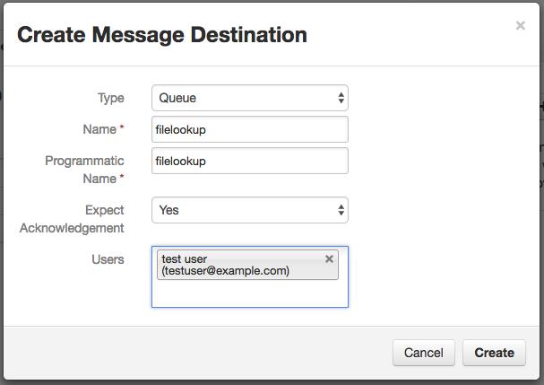
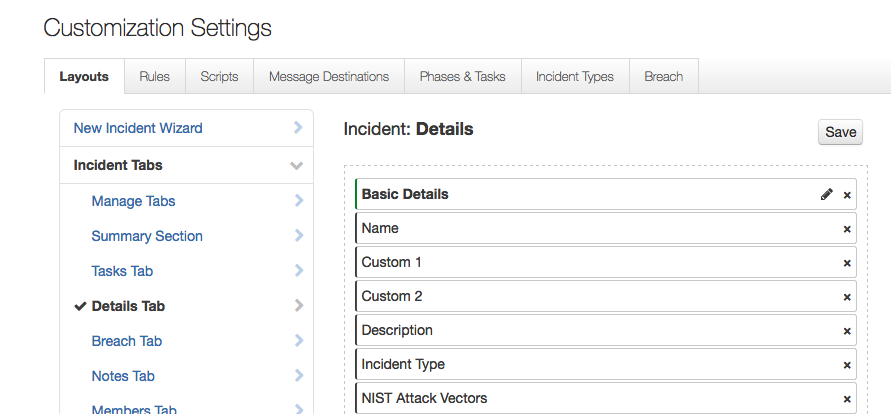
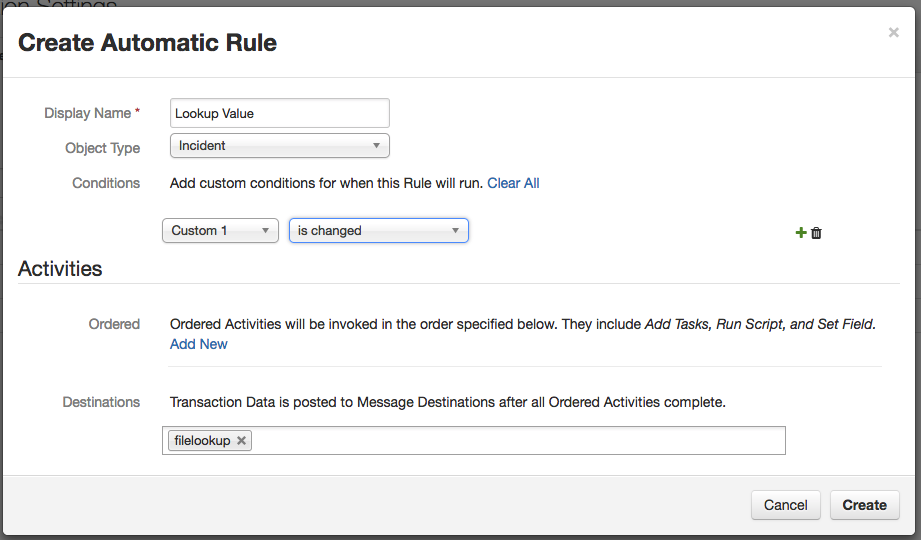
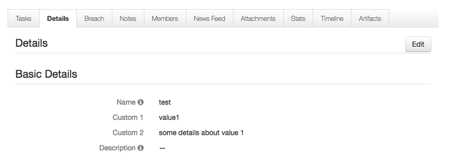

Lookup in Local File from Resilient
===================================

Use Case:  Lookup up the value of a Resilient incident field in a CSV
file on the local file system and store the result in another field in
that incident.  This automatic action is triggered whenever the
specified field value changes.

This integration can be run on the Resilient appliance or anywhere else.  
The code is written in Python, and can be extended for your own purposes.

Requires: Python version 2.7.x or 3.4.x or later.
Requires: Resilient Server or hosted Application, version 23 or later.

## Resilient server setup

You must configure the following customizations to the Resilient server.
Open the Administrator Settings --> Actions, then:

### Message Destination

Create a Queue message destination with programmatic name `filelookup`.
Select Yes for "expect acknowledgement", and add the integration user
to its users list.



### Custom Fields

Create two custom fields called 'custom1' and 'custom2', both of type
'Text'.  Add the new fields to the incident details so that you can
view them.



### Automatic Action

Create an automatic action named 'lookup_value', associated with object type
"Incident".  Choose `filelookup` as the message destination. Add condition
"custom1 is changed".



## Python setup

The Resilient REST API is accessed with a helper module 'co3' that should be
used for all Python client applications.  The 'co3' module is a part of the
Resilient REST API utilities 'co3-api'.  Download and install that first,
following its instructions.

This application is built using the circuits library.  The 'resilient-circuits'
framework should be downloaded and installed, following its instructions.

## Building the Integration
```
python setup.py sdist --formats=gztar
```

## Testing the Integration
The pytest\_resilient\_circuits package should be downloaded and installed, following its instructions.

# NOTE: These tests _WILL_ remove all configuration from your Resilient org.  Please ensure that the org they are run against is specifically for testing integrations and does not have any data you want retained.

To run tests for this integration in your current python environment:
```
python setup.py test -a "--resilient_email api_user@example.com --resilient_password MyPassword --resilient_host resilient --resilient_org \"Test Org\""
```

To run tests for this integration in all supported python versions with generated virtual environments, 
copy the co3, resilient-circuits, and pytest\resilient\_circuits packages to the taskadd directory and do:
```
pip install virtualenv
pip install tox
tox --  -a "--resilient_email api_user@example.com --resilient_password MyPassword --resilient_host resilient --resilient_org 'Test Org'"
```

## Installing the Integration

Install the integration with pip:
```
pip install dist/taskadd-27-0.0.tar.gz
```

## Configuring the Integration
The script reads configuration parameters from a file.
This file can be generated by running:
```
resilient-circuits config -c app.config
```
Edit this file to provide appropriate values
appropriate for your environment (server URL and authentication credentials).
Verify that the logging directory has been created.

If you already have other integrations installed and want to update your config
file to include settings for this integration, run:
```
resilient-circuits config -u app.config
```
The custom fields you wish to read from and write to can be updated here
in the 'source_field' and 'dest_field' sections.

### Certificates

If your Resilient server uses a self-signed TLS certificate, or some
other certificate that is not automatically trusted by your machine,
you need to tell the Python scripts that it should be trusted.
To do this, download the server's TLS certificate into a file,
e.g. from 'resilient.example.com' to a file 'cert.cer':

    mkdir -p ~/resilient/
    openssl s_client -connect resilient.example.com:443 -showcerts < /dev/null 2> /dev/null | openssl x509 -outform PEM > ~/resilient/cert.cer

Then specify the path to this certificate in the config file.

## Running the example
From the same directory as your app.config file, run the integration with:

    resilient-circuits run

The script will start running, and wait for messages.  When users in Resilient
update the value of 'custom1' on any incident, the application will look
up the value in sample.csv and, if found, will store the associated value
into 'custom2'.



To stop the script running, interrupt it with `Ctrl+C`.

## Tests
Install the pytest_resilient_circuits package.
To run the included tests, cd to the parent directory of your project:
  pytest -s --resilient_email <resilient account email> --resilient_host <IP or hostname> --resilient_password <resilient account password> --resilient_org <org name> 

To run the example against a mocked Resilient appliance:
  python run.py --resilient-mock resilient_filelookup_mock.MyResilientMock --test-actions
  
You can submit test actions with the res-action-test tool. For usage guidance, run:
  res-action-test
  (restest) help


## Extending the example

### Mapping Multiple Fields

If you need to populate more than one field via a local file lookup,
you can add another component to the existing application. Start by
duplicating the 'lookup' section of the config file and giving
the queue and the duplicated section itself a new name.  Update the
other fields to the their required values as well.  Make a copy of
file_lookup.py and store it in a components directory with a new
name.  Update the 'CONFIG_DATA_SECTION' line to match what you created
in the config file.  Add a "componentsdir" field to the config file and set 
it to the path of the components directory you created.
Add the new queue and action to the Resilient system.
Now when you run the application, it will handle mapping both fields.

### More
For more extensive integrations with stored data files, contact
[success@resilientsystems.com](success@resilientsystems.com).
