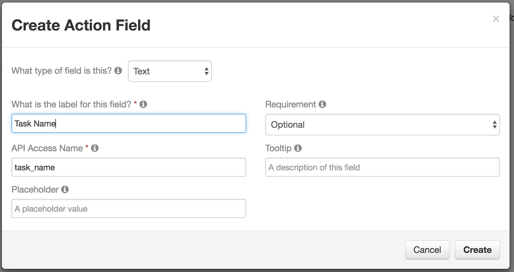
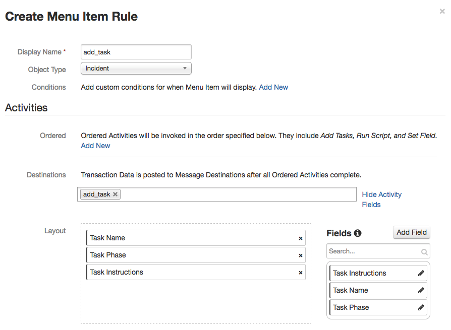

Add a task to a Resilient Incident
===================================

Use Case:  A manual action to create a configurable task on an incident

This integration can be run on the Resilient appliance or anywhere else.  
The code is written in Python, and can be extended for your own purposes.

Requires: Python version 2.7.x or 3.4.x or later.
Requires: Resilient Server or hosted Application, version 23 or later.

## Resilient server setup

You must configure the following customizations to the Resilient server.
Open the Administrator Settings --> Actions, then:

### Message Destination

Create a Queue message destination with programmatic name `add_task`.
Select Yes for "expect acknowledgement", and add the integration user
to its users list.

### Action Fields

Several action fields need to be created.
# `Text field` called "Task Name"
# `Text area field` called "Task Instructions"
# `Select field` called "Task Phase", whose options match your system's defined incident phases.
'Text'.  

### Manual Action

Create a manual action named 'add_task', associated with object type "Incident".  Choose `add_task` as the message destination.  Add the 3 custom action fields created above to the layout.

## Python setup

The Resilient REST API is accessed with a helper module 'co3' that should be
used for all Python client applications.  The 'co3' module is a part of the
Resilient REST API utilities 'co3-api'.  Download and install that first,
following its instructions.

This application is built using the circuits library.  The 'resilient-circuits'
framework should be downloaded and installed, following its instructions.

## Installing the Integration

Unpack the integration's files into the location where you will run them.

## Configuring the Integration

The script reads configuration parameters from a file.
The configuration file is named `app.config`, in the same
directory as the scripts.  Edit this file to provide appropriate values
appropriate for your environment (server URL and authentication credentials).
Verify that the logging directory has been created.

### Certificates

If your Resilient server uses a self-signed TLS certificate, or some
other certificate that is not automatically trusted by your machine,
you need to tell the Python scripts that it should be trusted.
To do this, download the server's TLS certificate into a file,
e.g. from 'resilient.example.com' to a file 'cert.cer':

    mkdir -p ~/resilient/
    openssl s_client -connect resilient.example.com:443 -showcerts < /dev/null 2> /dev/null | openssl x509 -outform PEM > ~/resilient/cert.cer

Then specify the path to this certificate in the config file.

## Running the example
A generic script is used to run all resilient-circuits integrations.  Copy this run.py file from the examples/circuits directory into your project directory at the same level as the components directory and app.config file.
Run the custom action application with:

    python run.py

The script will start running, and wait for messages.  When users in Resilient select the 'Add Task' action from the Actions dropdown, a new task will be added to the incident.

To stop the script running, interrupt it with `Ctrl+C` or kill the process.

## Extending the example

### Pre-configured tasks
Rather than a single "add task" action with user-entered instructions, you could define a number of tasks with pre-conconfigured instructions available to be added via manual action.

### Automatically add tasks
This could be adjusted to be an automatic action to add pre-configured tasks based on whatever trigger conditions are applicable.  For example, add a specified task whenever a certain custom field is changed.

### More
For more extensive integrations with stored data files, contact
[success@resilientsystems.com](success@resilientsystems.com).
