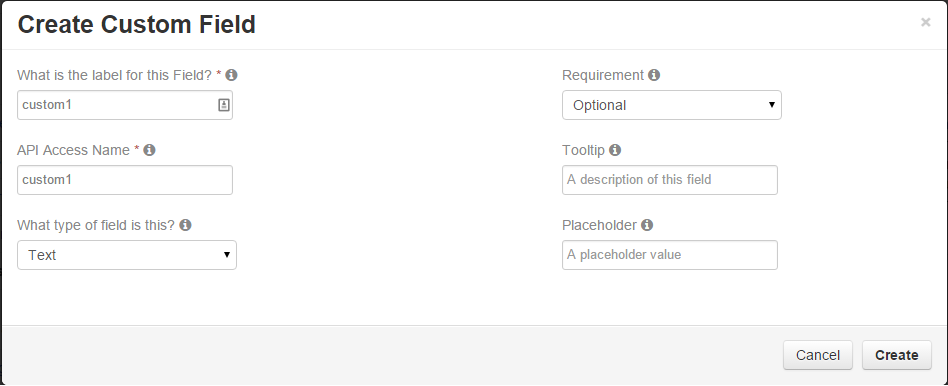
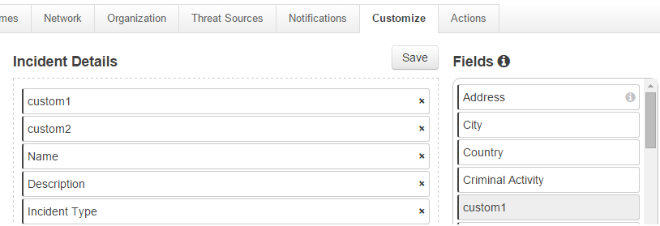
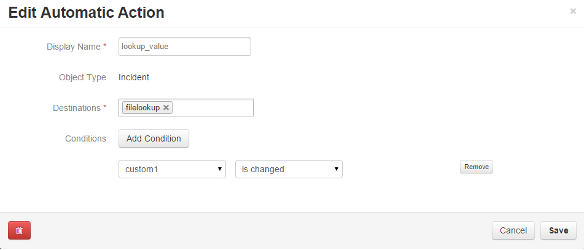
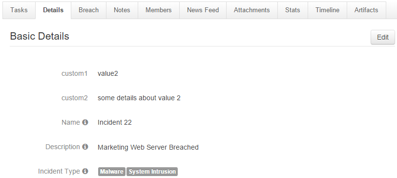

Lookup in Local File from Resilient
===================================

This example shows a simple integration between Resilient incidents and
the local file system.  We create an automatic action to lookup a value in 
a CSV file whenever a specified field value changes. The result of that lookup
is stored in a different specified field in the incident.

This integration can be run on the Resilient appliance or anywhere else.  
The code is written in Python, and can be extended for your own purposes.

Requires: Python version 2.7.x or 3.4.x or later. 
Requires: Resilient Server or hosted Application, version 23 or later.

## Resilient server setup

You must configure the following customizations to the Resilient server.
Open the Administrator Settings --> Actions, then:

## Message Destination

Create a Queue message destination with programmatic name `filelookup`.
Select Yes for "expect acknowledgement", and add the integration user
to its users list.

## Custom Fields

Create 2 custom fields called 'custom1' and 'custom2', both of type
'Text'.  Add the new fields to the incident details so that you can
view them. 

## Automatic Action

Create an automatic action named 'lookup_value', associated with object type
"Incident".  Choose `filelookup` as the message destination. Add condition
"custom1 is changed".

## Python setup

The Resilient REST API is accessed with a helper module 'co3' that should be
used for all Python client applications.  The 'co3' module is a part of the
Resilient REST API utilities 'co3-api'.  Download and install that first,
following its instructions.

This application is built using the circuits library.  The 'resilient-circuits' 
framework should be downloaded and installed, following its instructions.

## Installing the Integration

Unpack the integration's files into the location where you will run them.

## Configuring the Integration

The script reads configuration parameters from a file.
The configuration file is named `app.config`, in the same
directory as the scripts.  Edit this file to provide appropriate values
appropriate for your environment (server URL and authentication credentials).
Verify that the logging directory has been created.

## Certificates

If your Resilient server uses a self-signed TLS certificate, or some
other certificate that is not automatically trusted by your machine,
you need to tell the Python scripts that it should be trusted.
To do this, download the server's TLS certificate into a file,
e.g. from 'resilient.example.com' to a file 'cert.cer':

    mkdir -p ~/resilient/
    openssl s_client -connect resilient.example.com:443 -showcerts < /dev/null 2> /dev/null | openssl x509 -outform PEM > ~/resilient/cert.cer

Then specify the path to this certificate in the config file.

## Running the example

In the script directory, run the custom action application with:

    python run.py

The script will start running, and wait for messages.  When users in Resilient
update the value of 'custom1' on any incident, the application will look
up the value in sample.csv and, if found, will store the associated value
into 'custom2'. 

To stop the script running, interrupt it with `Ctrl+C`.

## Extending the example

For more extensive integrations with stored data files, contact
[success@resilientsystems.com](success@resilientsystems.com).