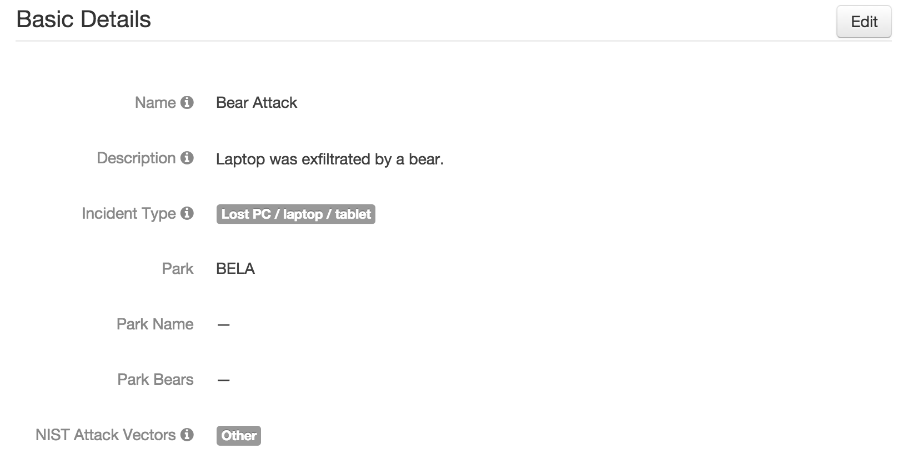

# Parks Service

This example is a demonstrator for a CMDB-like system.  It consists of

- A web service that exposes a corporate data source over SOAP.
  This example data source is the "parks service", with data about
  the wild bears in national parks of the USA.  In enterprise usage
  it would typically be a configuration-management, IT service management
  or master-data management system, depending on the application.

- Two styles of custom action that are commonly in this type of integration:

  - An automatic *Incident* Action.  When the incident is updated, if the
    'Park' field is changed, the action triggers.  The integration code
    queries the data source with the field's value, and updates the incident
    with the results.

  - A manual *Artifact* action.  When the action is selected,
    the integration code queries the data source using the artifact's
    value, and updates fields in the incident with the results.

### Requirements

The example web service is written in ASP.net.  On OSX or linux, this can be run
using [Mono](http://www.mono-project.com).  See [service/README.md](service/README.md).

The integration code is written in Python.  This requires the 'suds' module
to call SOAP web services.  We test using the `suds-jurko` version, which
you can install using

    pip install suds-jurko

### Parks data

The data for the parks service is pre-configured in a CSV file in the `service`
directory.  The list of park codes is also preconfigured, in a JSON file in the
`actions` directory, and used to create a custom field in Resilient.

The original source files for these data sets, and a script to prepare them,
can be found in the `data` directory.  You can run this script if you want to
change the list of parks or their attributes.

### Running the example

Follow the instructions in [service/README.md](service/README.md) to run the
web service that provides the parks data.

Follow the instructions in [action/README.md](action/README.md) to configure the
Resilient custom fields and custom actions, and to run the action listener script.

When the service and the script are running, you can trigger
actions in two ways:

1. Automatic action, when a Park is selected on an incident

   Edit the incident, choose a park code from the Park field, then save.

   

   Whenever the park code is changed, this triggers the automatic action.
   The incident will display the park code, then automatically update
   after the action has run, showing the full park name and its bears.

   

2. Manual action, when an artifact contains a park name.

   Create an artifact, of any type, and set its value to a park code,
   for example "BELA" (which has bears) or "SAMA" (which doesn't).

   Select the actions menu beside the artifact, and choose "Query with Parks Service".
   This triggers the manual action, using the value of the selected artifact.
   The incident details will update with the park code and details.

   
